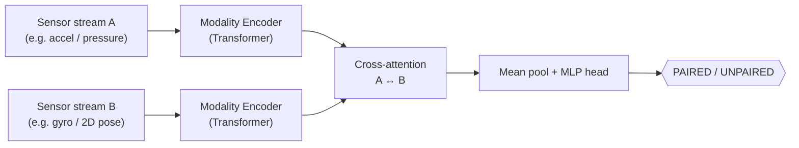

# CrossSense — Attentive Cross-Modal Sensor Pairing

Given two **time-series sensor streams**, decide whether they came from the
**same person** (`PAIRED`) or not (`UNPAIRED`). CrossSense learns this directly
from raw signals with a lightweight cross-attention model — no hand-crafted
features, no image rendering, no ImageNet backbone.

The method is modality-agnostic. It is demonstrated on two pairings:

| Pairing | Data | Status |
|---|---|---|
| **Accelerometer ↔ Gyroscope** | UCI HAR (public, 30 subjects) | **Benchmarked** — see below |
| **Plantar pressure ↔ 2D pose** | Smart-insole + OpenPose (original application) | On-task benchmark pending full dataset |

## Results — UCI HAR (subject-disjoint)

On the public [UCI HAR](https://archive.ics.uci.edu/dataset/240) dataset, the
model decides whether an **accelerometer** window and a **gyroscope** window came
from the same person. Scored **subject-disjoint** — the 9 test subjects are never
seen during training, so the score reflects generalisation to new people, not
memorised per-subject signal.

| Metric | Score |
|---|---|
| Accuracy | **0.811** |
| Macro-F1 | **0.810** |
| ROC-AUC | **0.872** |

*30 subjects, 9 held out, 6,038 test pairs, 12 epochs, 185K-param model.
Reproduce:* `python scripts/har_benchmark.py --zip <har.zip>`

> Note: this is **cross-modal person pairing**, a non-standard use of UCI HAR
> (whose standard task is 6-class activity recognition). Reported as such.

## Method



Each modality is encoded by a small Transformer over the time axis; the two
streams then attend to each other before a pairing head. ~185K parameters —
**~79× smaller** than the VGG16 backbone of the original image-rendering baseline,
and with no ImageNet dependency.


## Install

```bash
pip install -r requirements.txt
```

**RTX 5060 / Blackwell (sm_120):** install the CUDA 12.8 torch build:

```bash
pip install torch --index-url https://download.pytorch.org/whl/cu128
```

## Usage

```bash
# UCI HAR benchmark (downloads/uses the public dataset zip)
python scripts/har_benchmark.py --zip <har.zip> --epochs 12

# Train on paired CSV streams (smart-insole-*.csv + open-pose-*.csv)
python src/train.py --data-dir <data_dir> --epochs 30

# Subject-disjoint benchmark on CSV data (Accuracy / F1 / ROC-AUC)
python src/evaluate.py --data-dir <data_dir> --epochs 40 --test-frac 0.3

# Smoke test the pipeline on synthetic data (no dataset required)
python src/train.py --synthetic --epochs 15

# Inference: same person?
python src/infer.py --ckpt model/cross_attn.pt \
    --insole sample-test-data/smart-insole-A.csv \
    --openpose sample-test-data/open-pose-1.csv
```

**Honest benchmarking.** `src/evaluate.py` and `scripts/har_benchmark.py` hold out
*whole subjects* for the test set. A random split would leak per-subject signal
and inflate the score; both refuse to score on fewer than 2 subjects per split
(so the 2-subject insole/pose sample is intentionally rejected).

> The synthetic generator is for development/CI sanity only — not a benchmark.

## Original application & legacy baseline (`codes/`)

CrossSense grew out of a plantar-pressure / 2D-pose person-pairing project. The
original TensorFlow baseline (render each frame to a 32×32 image → frozen VGG16 →
LSTM) is preserved unchanged in `codes/`:

```bash
cd codes
pip install -r requirements-legacy.txt
python train.py
python app.py
```

Trained baseline weights (`model/*.hdf5`, ~87 MB) are not tracked in git. Full
insole/pose dataset: links in `train-sets/`.

## Credits

- Original plantar-pressure / 2D-pose method & TensorFlow baseline:
  **Sevendi Eldrige Rifki Poluan** (2022).
- Cross-attention model, benchmarks, and this repository:
  **Jayant Batra**, **Harshita Narula**.
