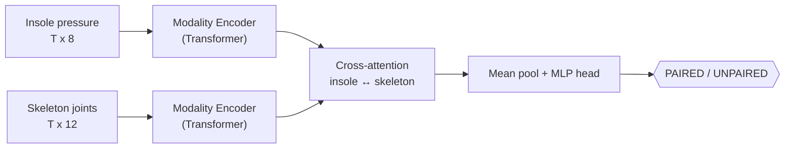

# PressPose — Attentive Cross-Modal Pairing of Plantar Pressure and 2D Pose

Person association for social-robot HRI: given a **smart-insole pressure stream**
and an **OpenPose 2D-skeleton stream**, decide whether they belong to the *same
person* (`PAIRED`) or not (`UNPAIRED`).

This repo contains two implementations of that task:

| | Pipeline | Stack | Notes |
|---|---|---|---|
| **`src/` (current)** | Learned **cross-modal attention** directly on raw signals | PyTorch | No image rendering, no ImageNet backbone, edge-deployable |
| **`codes/` (baseline)** | Render each frame to a 32×32 image → frozen **VGG16** → **LSTM** | TensorFlow | Original method, built to train on an NVIDIA TX2 |

## Why the new model

The baseline turns raw sensor numbers into little pictures so a pretrained CNN can
read them — clever, but heavyweight and ImageNet-dependent. The new model drops
that entirely and learns on the signals themselves:



Each modality is encoded with a small Transformer over the time axis, then the two
streams attend to each other (insole↔skeleton) before a pairing head. It is far
smaller than VGG16+LSTM and runs comfortably on modern GPUs (incl. RTX 5060 /
Blackwell — see GPU note below) or CPU.


## Install

```bash
pip install -r requirements.txt
```

**RTX 5060 / Blackwell (sm_120):** install the CUDA 12.8 torch build:

```bash
pip install torch --index-url https://download.pytorch.org/whl/cu128
```

(TensorFlow's Windows-native GPU support ends at 2.10 — for the legacy `codes/`
baseline on GPU, use WSL2.)

## Usage

```bash
# Smoke test the whole pipeline on synthetic data (no dataset required)
python src/train.py --synthetic --epochs 15

# Train on real CSVs (smart-insole-*.csv + open-pose-*.csv in a folder)
python src/train.py --data-dir sample-test-data --epochs 30

# Inference: is this insole stream the same person as this pose stream?
python src/infer.py --ckpt model/cross_attn.pt \
    --insole sample-test-data/smart-insole-A.csv \
    --openpose sample-test-data/open-pose-1.csv
```

Data format: insole CSVs carry 8 pressure channels
(`R/L_HEEL, R/L_THUMB, R/L_INNER_BALL, R/L_OUTER_BALL`); OpenPose CSVs carry
lower-body joint coordinates. Streams are aligned by wall-clock second and
resampled to a fixed window length.

Regenerate the figures in this README with:

```bash
python scripts/make_figures.py
```


> The synthetic generator and the curve above are for development/CI sanity only
> — they are **not** a benchmark or research result.

## Legacy baseline (`codes/`)

The original TensorFlow method is preserved unchanged. See `codes/requirements-legacy.txt`
and the commands below.

```bash
cd codes
pip install -r requirements-legacy.txt
python splitdatasets.py     # chunk dataset for low-memory (TX2) training
python train.py             # full training
python lightweighttrain.py  # lightweight training
python app.py               # run the app
```

Trained baseline weights (`model/*.hdf5`, ~87 MB) are not tracked in git — keep
them locally or attach them to a release. Full datasets: see links in `train-sets/`.

## Authors & credits

- Original method and TensorFlow baseline: **Sevendi Eldrige Rifki Poluan** (2022).
- Contributors: **Harshita Narula** (`harshitanarula08@gmail.com`).
- Cross-modal attention extension: this repository.
